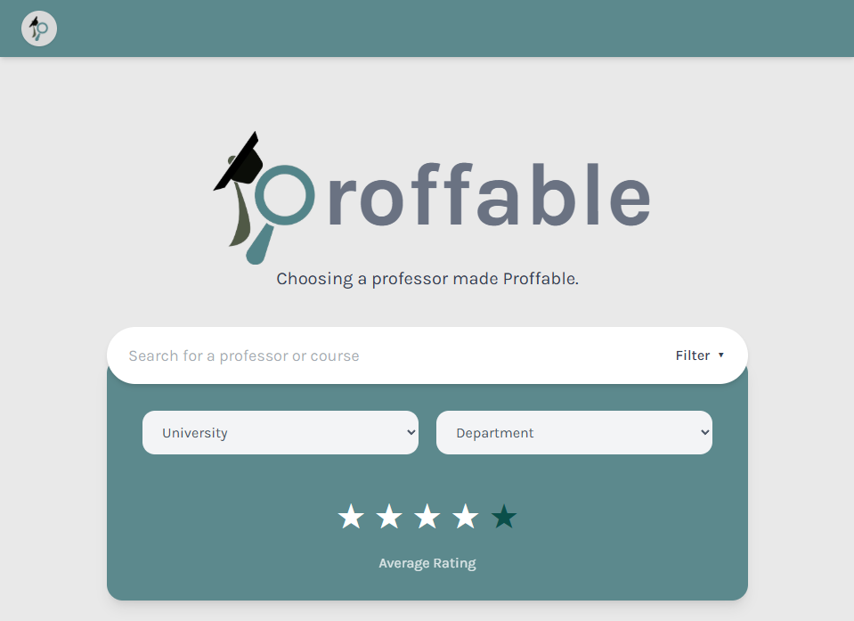
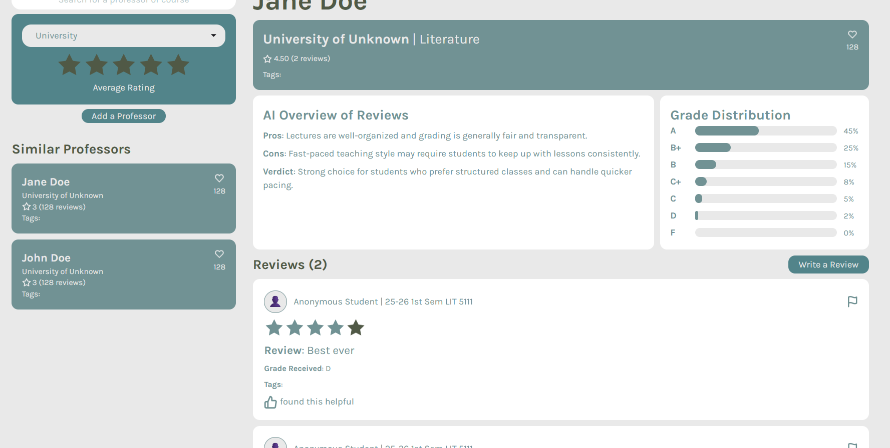

# Proffable

> Choosing a professor made Proffable.
> 

Find and learn what other students think of your professors with ease.

Made with Philippine university students in mind.
___



## 🔎 Overview
Proffable is a self-contained web-based application developed to address the lack of a centralized, user-friendly platform for sharing professor reviews within Philippine universities. The software is designed as an independent system to complement current academic information platforms by focusing specifically on qualitative student feedback accessible to all. The software is intended to operate independently from official Ateneo systems such as AISIS. 
## 🛠️ Tech Stack
Proffable is built using a modern decoupled architecture to ensure scalability and a smooth user experience.
- Frontend: Vue.js 3 (Composition API) + Tailwind CSS
- Backend: Django REST Framework (DRF)
- Database: PostgreSQL
- Authentication: OAuth 2.0 (Google/Social Auth)
- API Client: Axios
- Intelligence: LLM Integration for Review Summarization
- Containerization: Docker & Docker Compose

## ⭐ Core Functions
Proffable provides a set of core functions that allow Philippine university students access and contribute professor-related feedback through a centralized web platform. At a high level, the system supports the following major functions: 
1. **Student Login System**
    - Allow students to register and log in to the platform in order to access personalized features and submit reviews
2. **Professor Reviews and Structured Review Form**
    - Enable authenticated users to submit structured reviews and ratings for professors based on predefined criteria 
3. **Professor Search, Sorting, and Filtering**
    - Allow users to search for professors, sort them, and filter results based on relevant attributes such as department, course, or overall rating
4. **Helpful Review and Reporting System **
    - Allow users to mark reviews as helpful and report inappropriate or misleading content for moderation 
5. **Similar Professors and Favorites**
    - Provide recommendations for similar professors and allow users to save selected professors to a favorites list for quick access
6. **Professor Profile Creation**
    - Allows students to submit information regarding professors who are not yet in the system
7. **Grade Distribution Visualization**
    - Shows a summary of how students have reported the grade distribution under specific professors
8. **AI Review Summary**
    - Through the use of an LLM, summarize reviews to give users a quick overview
9. **Moderation Tools**
    - Provides moderators with limited administrative power over the system to manage professor profiles and handle reports.

## 🔧 Installation
This project is fully containerized using Docker for easy deployment and local development.
### 🧰 Prerequisites
- Docker Desktop
- Git

### 🚀 Getting Started
1. **Clone the repository**

    ```bash
    git clone https://github.com/Angelo-Funelas/Proffable.git
    ```

2. **Configure Environment Variables**

    Create `.env` files inside the `backend` and `frontend` directories (refer to `.env.example`) to set your OAuth Keys.

3. **Build and Run with Docker**
    ```bash
    docker-compose up --build
    ```
4. **Access the Application**

    Open `http://localhost:5173/`